## 📗 Manual de Usuario – Sistema de Restaurante

### 1. Presentación del sistema

Este sistema es una aplicación web pensada para apoyar la gestión de un restaurante.  
Permite trabajar de forma sencilla con:

- **Categorías** de platos  
- **Platos** del menú  
- **Mesas** del salón  
- **Órdenes o pedidos**  
- **Entregas (delivery)**  
- **Usuarios y autenticación (login / registro)**  

La idea de este manual no es explicar la parte técnica interna, sino mostrar **cómo usar la herramienta paso a paso** desde el navegador.

---

### 2. Acceso al sistema

- **URL de ejemplo del frontend**:  
  `http://localhost:4200/`

Cuando el sistema está en ejecución:

1. Abre tu navegador (Chrome, Edge, Firefox, etc.).
2. Escribe la URL del sistema.
3. Si ya iniciaste sesión antes, normalmente verás la pantalla de **Inicio (Home)**.

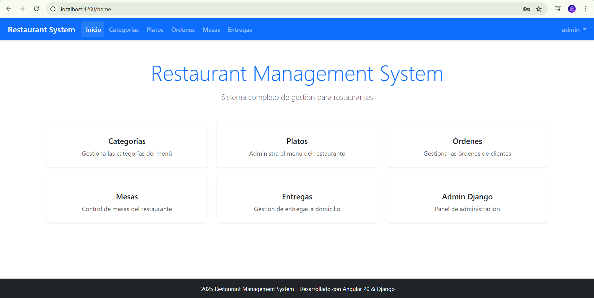

---

### 3. Autenticación de usuarios

El sistema maneja usuarios con autenticación mediante **token (JWT)**, pero como usuario normal solo verás las pantallas típicas de:

- **Inicio de sesión (Login)**: `/auth/login`  
- **Registro**: `/auth/register`

#### 3.1. Iniciar sesión

1. En el navegador, ingresa a: `http://localhost:4200/auth/login`.
2. Escribe tu **usuario o correo** y tu **contraseña**.
3. Haz clic en el botón **“Iniciar sesión”**.
4. Si los datos son correctos, el sistema te llevará a la página de **Inicio**.

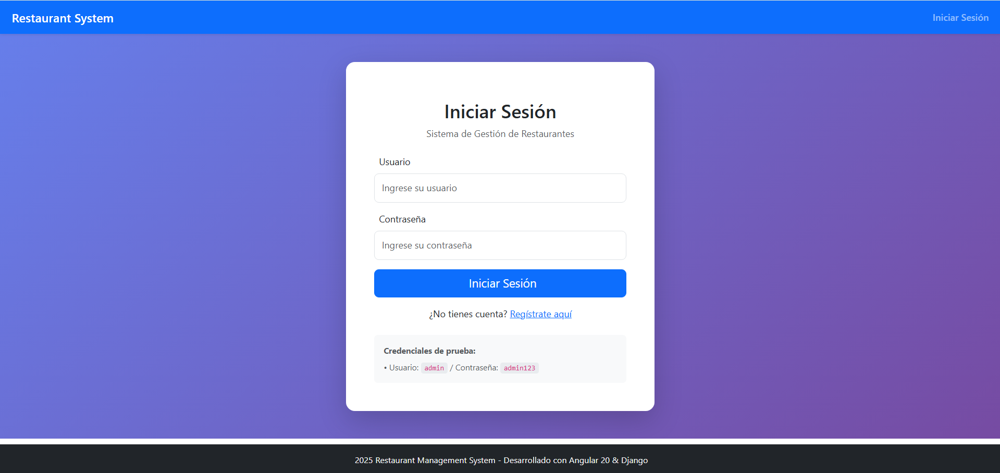

#### 3.2. Registrarse como nuevo usuario

1. En el navegador, entra a: `http://localhost:4200/auth/register`.
2. Completa el formulario con tus datos (usuario, correo, contraseña, confirmación, etc.).
3. Haz clic en **“Registrarse”**.
4. Luego podrás ir a la pantalla de **Login** e iniciar sesión con tu nueva cuenta.

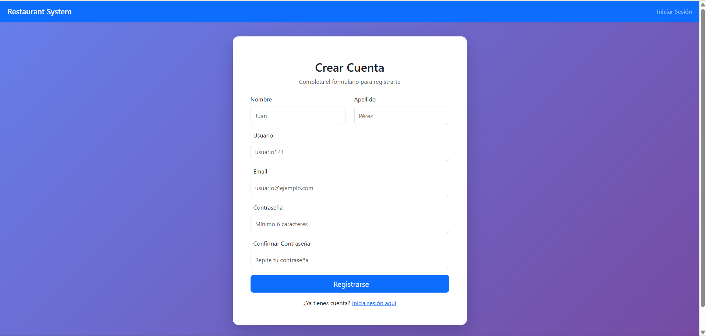

---

### 4. Módulo de Categorías

Ruta principal en el frontend: `/categories`

En este módulo se administran las **categorías de los platos**, por ejemplo: “Entradas”, “Platos fuertes”, “Postres”, etc.

#### 4.1. Ver el listado de categorías (Leer)

1. Desde el menú principal, entra a **Categorías**.
2. Se mostrará una tabla con las categorías existentes, donde normalmente verás:
   - Nombre
   - Descripción
   - Estado (`ACTIVE` / `INACTIVE`)

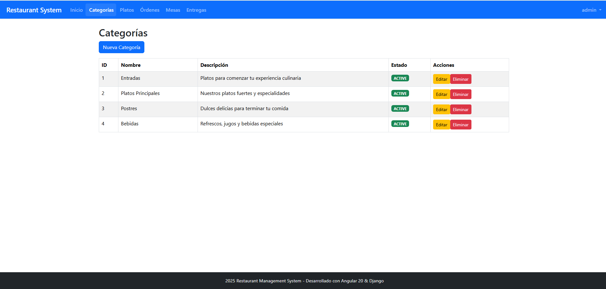

#### 4.2. Crear una nueva categoría (Crear)

1. En la pantalla de categorías, busca y haz clic en el botón **“Nueva categoría”** o similar.
2. Completa los campos:
   - **Nombre** de la categoría.
   - **Descripción** (para qué se usa).
   - **Estado**: `ACTIVE` (activa) o `INACTIVE` (inactiva).
3. Presiona **“Guardar”**.
4. La nueva categoría debe aparecer en el listado.

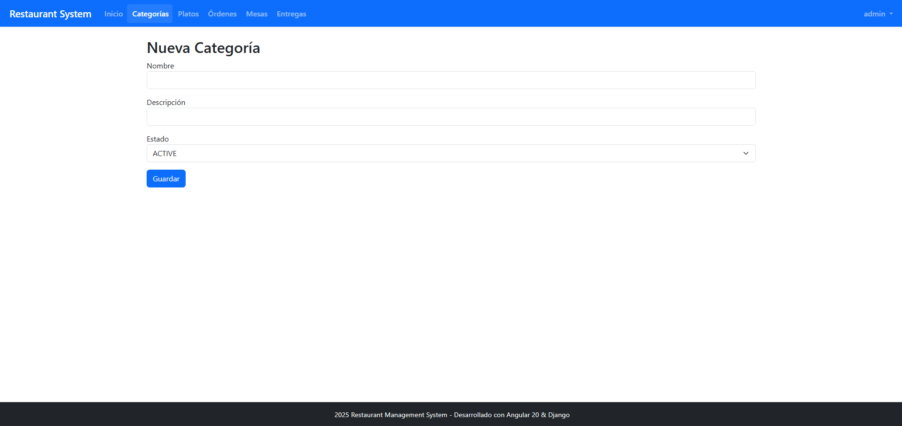

#### 4.3. Editar una categoría (Actualizar)

1. En el listado, ubica la categoría que quieras modificar.
2. Haz clic en el botón de **Editar** (generalmente un ícono de lápiz).
3. Cambia la información que necesites (por ejemplo el nombre o el estado).
4. Haz clic en **“Actualizar”** o **“Guardar cambios”**.

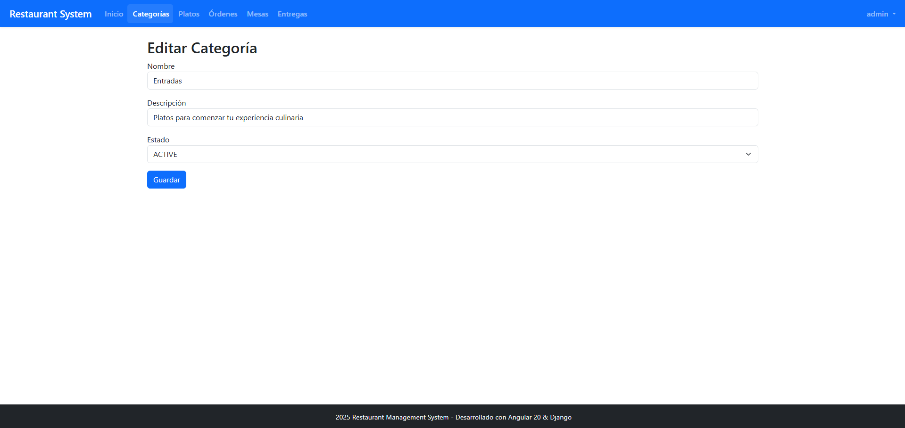

#### 4.4. Eliminar una categoría (Eliminar)

1. En el listado de categorías, selecciona la fila de la categoría.
2. Haz clic en el botón de **Eliminar** (suele ser un ícono de basurero).
3. El sistema normalmente pedirá confirmación para evitar borrar algo por error.
4. Acepta la confirmación y verifica que la categoría desaparece del listado.

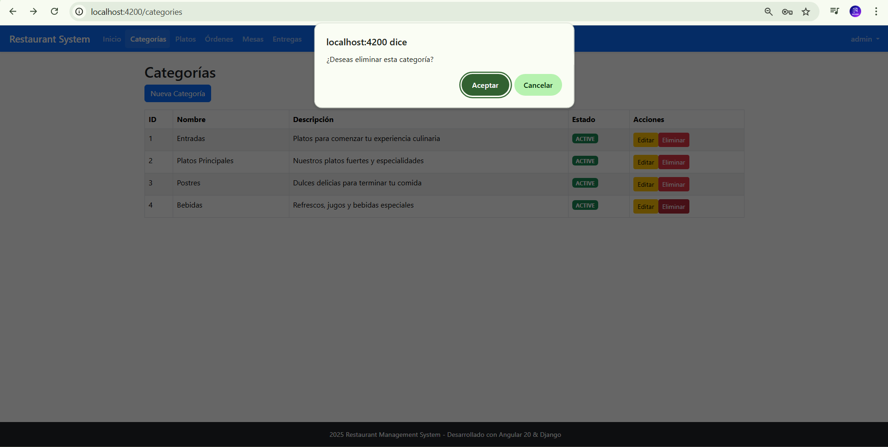

---

### 5. Módulo de Platos (Dishes)

Ruta principal: `/dishes`

Aquí se administran los platos que realmente se venden en el restaurante.

Cada plato tiene:

- Nombre  
- Descripción  
- Precio  
- Categoría (relacionado con el módulo de Categorías)  
- Estado (`ACTIVE` / `INACTIVE`)  

#### 5.1. Ver el listado de platos

1. Desde el menú, ingresa a **Platos**.
2. Verás una tabla con todos los platos registrados.
3. Normalmente se muestran columnas como: nombre, categoría, precio y estado.

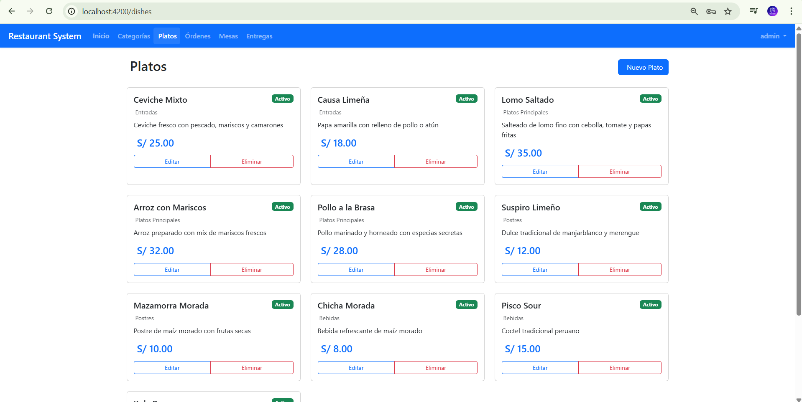

#### 5.2. Crear un nuevo plato

1. En la pantalla de platos, haz clic en **“Nuevo plato”**.
2. Completa los campos:
   - **Nombre del plato**
   - **Descripción**
   - **Precio**
   - **Categoría** (selecciona una ya creada)
   - **Estado** (`ACTIVE` / `INACTIVE`)
3. Confirma con el botón **“Guardar”**.

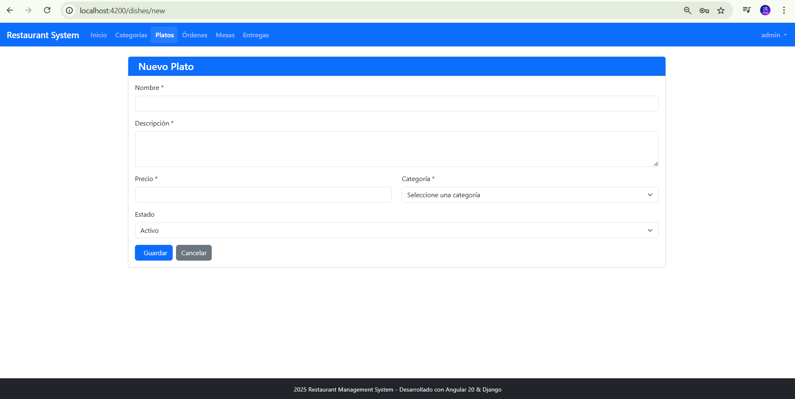

#### 5.3. Editar un plato

1. Ubica el plato que se va a modificar en el listado.
2. Haz clic en **Editar**.
3. Actualiza los campos necesarios (por ejemplo el precio).
4. Guarda los cambios.

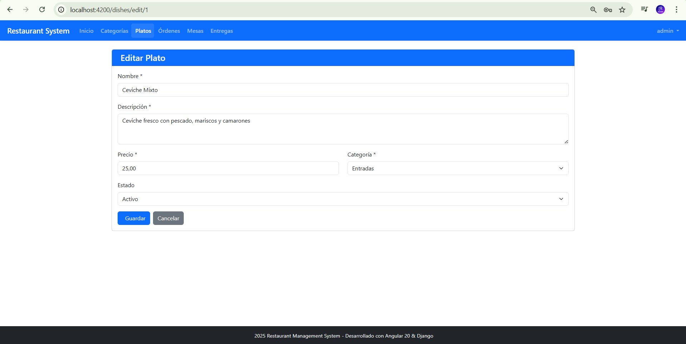

#### 5.4. Eliminar un plato

1. Selecciona el plato a eliminar en la tabla.
2. Haz clic en **Eliminar**.
3. Confirma la operación cuando el sistema lo pida.

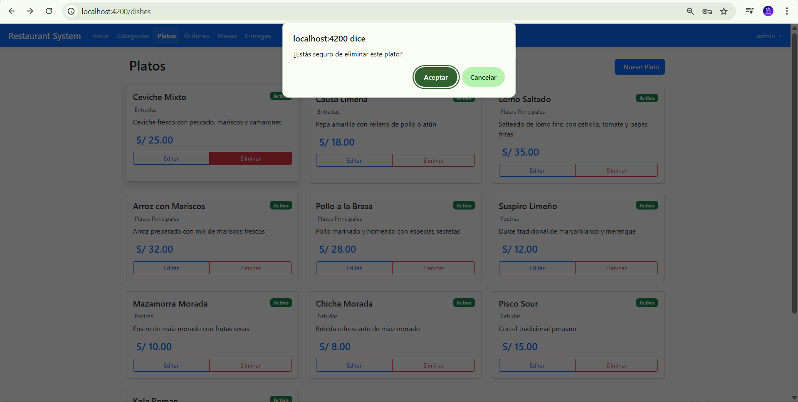

---

### 6. Módulo de Mesas (Tables)

Ruta principal: `/tables`

Este módulo sirve para registrar las **mesas físicas** del restaurante y su estado:

- `AVAILABLE` (disponible)  
- `OCCUPIED` (ocupada)  
- `RESERVED` (reservada)  

#### 6.1. Ver listado de mesas

1. Ingresa al menú **Mesas**.
2. Aparece un listado con:
   - Número de mesa
   - Capacidad
   - Estado actual

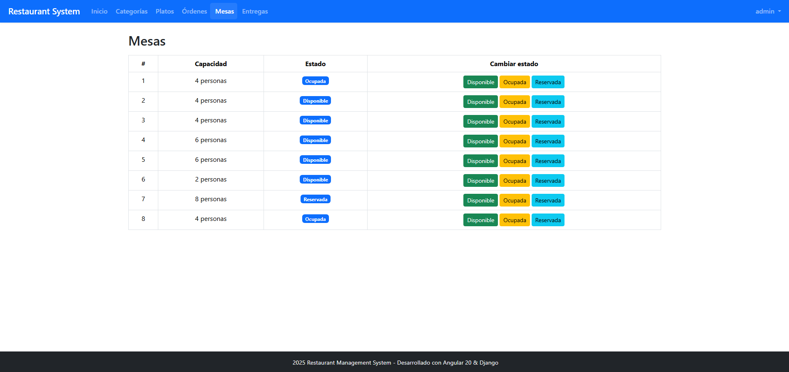

#### 6.2. Actualizar una mesa

1. En el listado, selecciona la mesa a modificar.
2. Entra a **Editar**.
3. Cambia los datos necesarios (ejemplo: pasar de `AVAILABLE` a `OCCUPIED`).
4. Guarda.

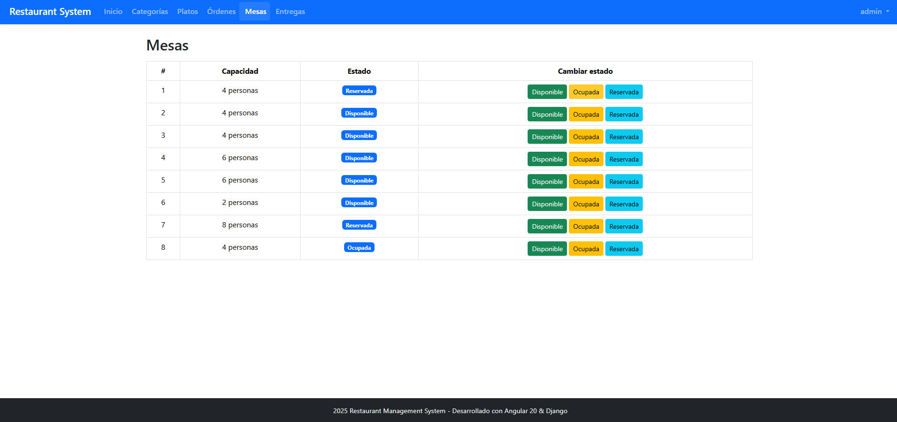

---

### 7. Módulo de Órdenes (Orders)

Ruta principal: `/orders`

Este es uno de los módulos centrales. Permite registrar los pedidos de los clientes y relacionarlos con mesas y/o entregas a domicilio.

Cada orden tiene, entre otras cosas:

- Fecha y hora  
- Estado (`PENDING`, `PREPARING`, `READY`, `DELIVERED`, `CANCELLED`)  
- Tipo (`DINE_IN`, `TAKEOUT`, `DELIVERY`)  
- Total  
- Detalle con los platos y cantidades  

#### 7.1. Ver listado de órdenes

1. Desde el menú, ingresa a **Órdenes**.
2. Verás una tabla con las órdenes existentes y columnas como:
   - Número de orden
   - Fecha
   - Estado
   - Tipo
   - Total

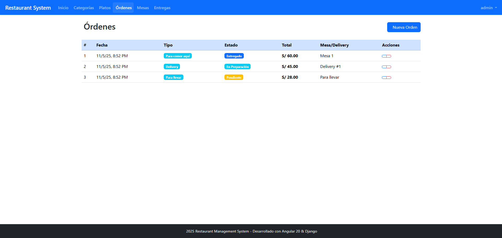

#### 7.2. Crear una nueva orden

1. Haz clic en **“Nueva orden”**.
2. Indica el **tipo de orden**:
   - Comer en el lugar (relacionada con una mesa).
   - Para llevar.
   - Delivery.
3. Si es para comer en el lugar, selecciona una **mesa disponible**.
4. Agrega los **platos** al pedido:
   - Selecciona el plato.
   - Define la cantidad.
   - El sistema calcula subtotales y total.
5. Guarda la orden.

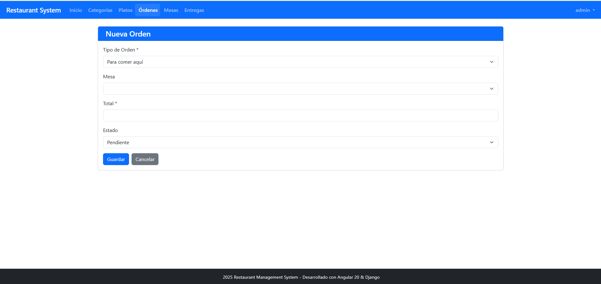

#### 7.3. Ver detalle de una orden

1. En el listado de órdenes, ubica la que quieres revisar.
2. Se muestra la información general (fecha, estado, tipo, total) y el detalle de platos incluidos.

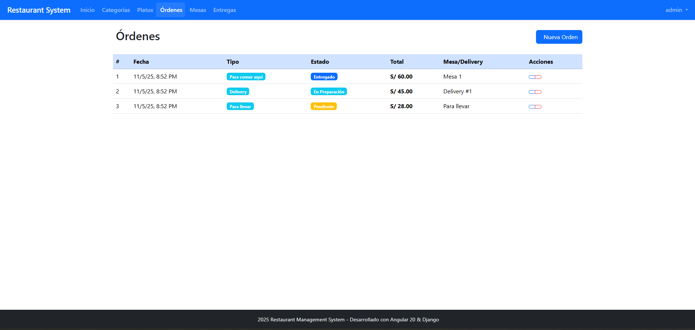

#### 7.4. Eliminar una orden

1. En el listado, selecciona la orden a eliminar.
2. Haz clic en el botón rojo.
3. Confirma la acción.

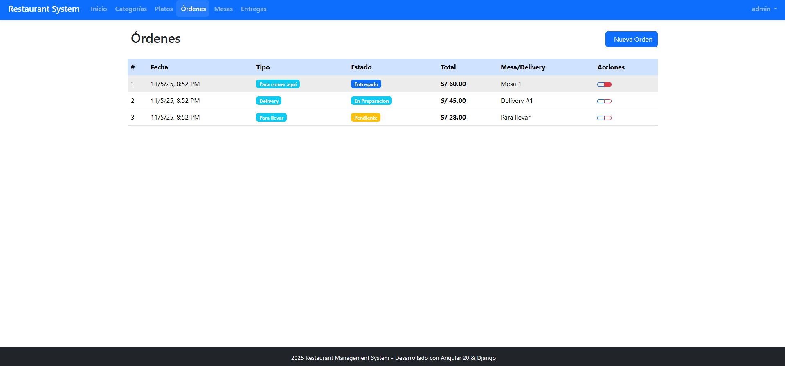

---

### 8. Módulo de Deliveries (Entregas)

Ruta principal: `/deliveries`

En este módulo se lleva el control de las **entregas a domicilio** y de los **repartidores**.

#### 8.1. Ver listado de deliveries

1. En el menú, elige **Deliveries**.
2. Se presenta un listado donde normalmente ves:
   - Cliente
   - Dirección
   - Teléfono
   - Costo
   - Repartidor asignado (si aplica)

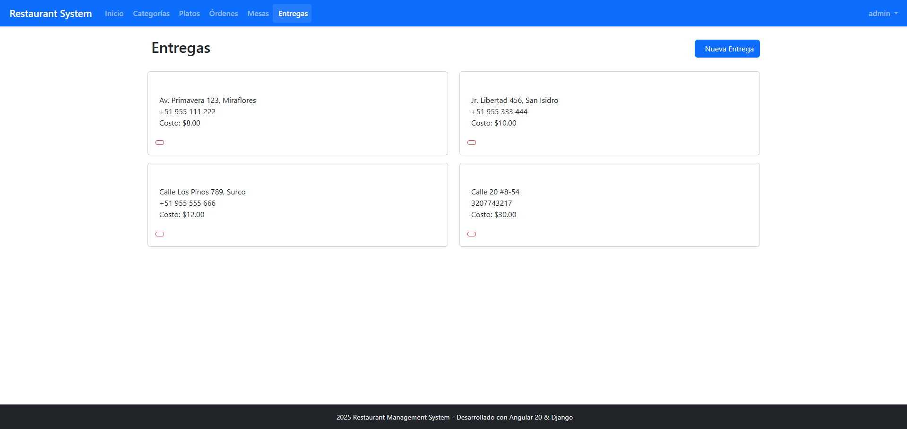

#### 8.2. Crear un delivery

1. Haz clic en **“Nueva entrega”**.
2. Completa los datos:
   - Nombre del cliente.
   - Dirección.
   - Teléfono de contacto.
   - Costo del envío.
   - Repartidor (si se maneja desde el formulario).
3. Guarda la información.

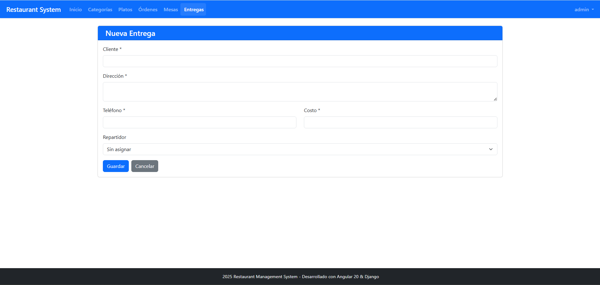

#### 8.3. Eliminar un delivery

1. En el listado, elige la entrega a eliminar.
2. Haz clic en el botón rojo.
3. Confirma cuando aparezca el mensaje de aviso.

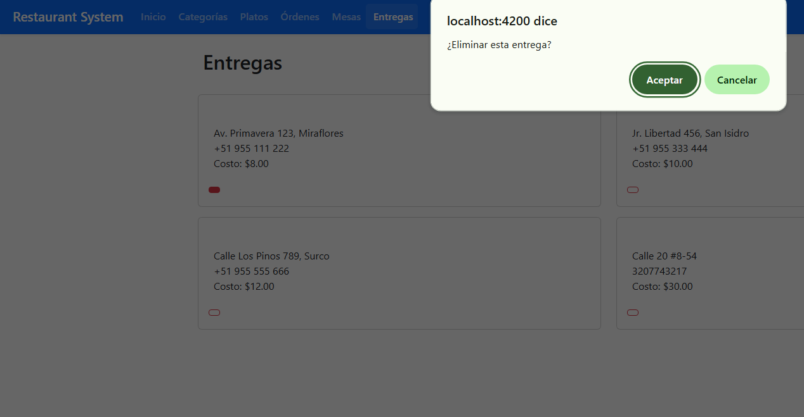

---

### 9. Cerrar sesión

Para salir del sistema:

1. Ubica la opción de **Cerrar sesión** (suele estar en la parte superior o en un menú de usuario).
2. Haz clic en **“Cerrar sesión”**.
3. El sistema borra el token de autenticación y te redirige a la pantalla de **Login**.

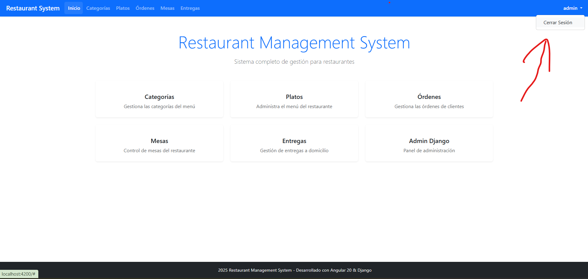

---

### 10. Recomendaciones prácticas

- Mantener actualizadas las **categorías** y los **platos** para que no haya errores al tomar órdenes.
- Verificar el **estado de las mesas** antes de asignar nuevas órdenes.
- Cambiar el **estado de las órdenes** conforme avanzan en la preparación, para tener un control realista.
- Revisar periódicamente los datos de **delivery** (direcciones, teléfonos) para evitar entregas equivocadas.

